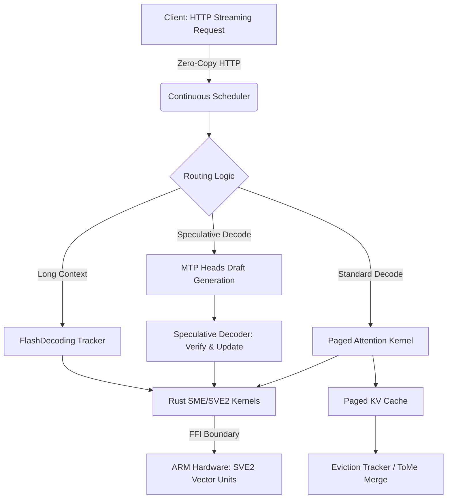

# SME-Optimized Local LLM Home Server (v1.0.0)

This repository implements a low-power ARM home server capable of running 7B–14B parameter LLMs (e.g., Llama 3/4) with custom C++/Rust kernels. It leverages ARM SME/SVE2 instructions for high-throughput, memory-safe, and continuous-batched inference at the edge.

## 🏗️ Architecture Diagram



---

## 📂 Directory Layout
```text
    edge_ai_project/
├── CMakeLists.txt                 # Main build configuration (includes ASAN support)
├── aarch64-toolchain.cmake        # Cross-compilation toolchain definition
├── README.md                      # This file
├── LICENSE                        # MIT License
├── .gitignore                     # Git ignore rules
├── docker_cross_env/
│   └── Dockerfile                 # Multi-stage Docker build (Builder + Stripped Runtime)
├── server/                        # C++ HTTP inference server & scheduling logic
│   ├── continuous_scheduler.cpp   # Day 37/38: Unified decode dispatch & hardened eviction
│   ├── mtp_heads.cpp              # Day 36/38: MTP speculative draft generation
│   ├── eviction_tracker.cpp       # Day 38: Hardened KV cache eviction
│   └── ...                        # Other core server modules
├── src/sme_kernel/rust_sme/       # Rust SVE2/SME optimized kernels
│   ├── Cargo.toml
│   └── src/lib.rs                 # FFI exports with panic-handling guarantees
├── benchmark/
│   ├── benchmark_e2e_throughput.py # End-to-end throughput testing
│   └── benchmark_mtp_speedup.py    # MTP speculative decoding speedup metrics
├── scripts/
│   └── run_asan_check.sh          # Day 38: Automated AddressSanitizer validation script
└── config.yaml                    # Runtime configuration
```

---

## 🚀 Getting Started

### Prerequisites
- Ubuntu 22.04 LTS (or equivalent Debian-based system)
- CMake ≥ 3.15, Ninja, GCC/Clang
- Rust toolchain (with aarch64-unknown-linux-gnu target for cross-compilation)

### Standard Release Build
```bash
# 1. Build the Rust SVE2/SME kernels
cd src/sme_kernel/rust_sme
cargo build --release --target aarch64-unknown-linux-gnu
cd ../../..

# 2. Configure and build the C++ server
mkdir -p build && cd build
cmake -DCMAKE_TOOLCHAIN_FILE=../aarch64-toolchain.cmake -DCMAKE_BUILD_TYPE=Release ..
make -j$(nproc)
```

---

## 🛡️ Memory Safety Validation (AddressSanitizer)
To guarantee zero memory leaks, use-after-free, or buffer overflows before deployment:
```bash
chmod +x scripts/run_asan_check.sh
./scripts/run_asan_check.sh
```

---

## 📊 Benchmark Results
See [Benchmark.csv](Benchmark.csv) for detailed performance metrics.

---

## 🐳 Docker Deployment
Build the optimized, multi-stage Docker image (final binary is stripped of debug symbols):
```bash
docker build -f docker_cross_env/Dockerfile -t edge-ai-server:v1.0.0 .
docker run -p 8080:8080 --rm edge-ai-server:v1.0.0
```